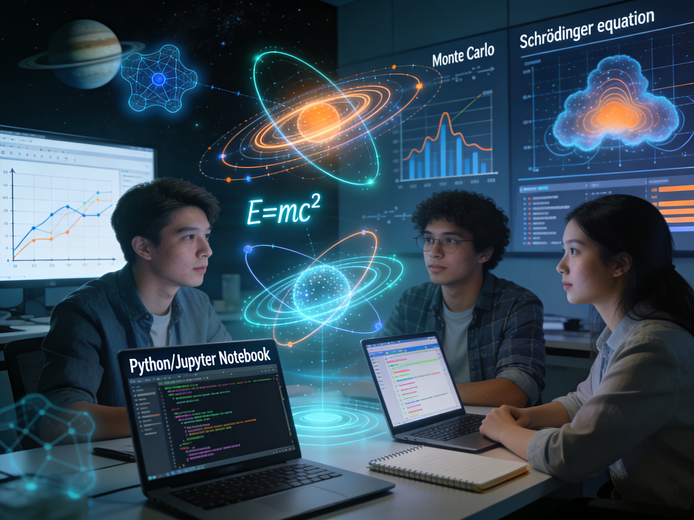

# AI-Aware Project-Based Physics Education: Computational Modeling, Scientific Reasoning, and Modern Assessment

This project originated through participation in the Utah Valley University (UVU) Faculty Summer Institute, 
which focused on designing workforce-aligned learning experiences through credit for prior learning, embedded 
credentials, project-based learning, industry partnerships, continuing education pathways, and the responsible 
use of artificial intelligence to enhance teaching and assessment. The institute provided me with an opportunity 
to rethink how introductory physics education can better reflect the realities of modern scientific and 
engineering practice, particularly as computational tools and AI-supported workflows become increasingly 
integrated into research and industry environments.

The original vision of the project centered on developing several scaffolded computational physics 
modules together with embedded workforce-oriented microcredentials. However, through testing, reflection, 
and iterative development, the project evolved in a different direction. It became increasingly clear 
that highly scaffolded instructor-designed projects often limited student ownership and reduced opportunities 
for authentic scientific synthesis. At the same time, the rapidly growing role of AI in computational 
work raised important questions about how to preserve scientific reasoning and intellectual ownership 
within AI-supported learning environments.

As a result, the project shifted toward a more flexible and student-driven framework emphasizing 
computational physics, project-based learning, responsible AI use, and AI-aware assessment practices. 
Rather than guiding students through predefined projects, the framework encourages students to develop 
their own computational physics investigations using Python, Jupyter notebooks, numerical modeling, 
uncertainty analysis, and modern AI-supported workflows. Central to this approach is the idea that 
AI should function as a research mentor and computational support tool rather than a replacement 
for scientific thinking. The ultimate goal is not simply to help students complete projects more 
efficiently, but to help them become stronger scientific thinkers capable of critically engaging 
with modern computational and AI-supported scientific practice.

