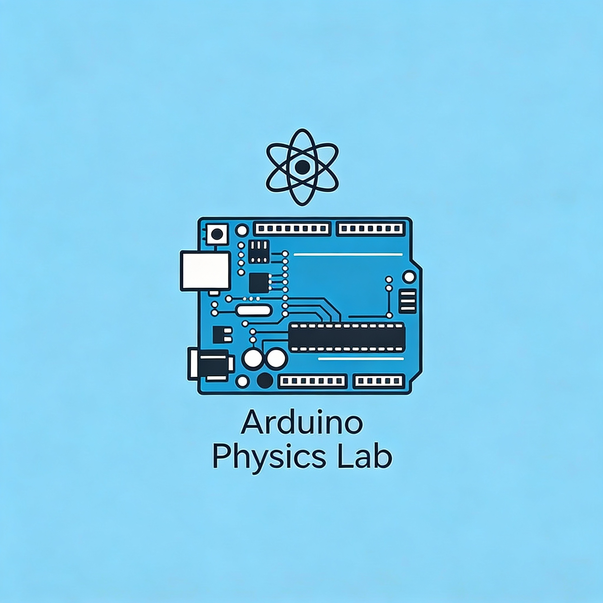

# Arduino Physics Lab: Thinking Like an Experimental Physicist

Arduino Physics Lab is a hands-on e-book designed to bridge the gap between physical theory and 
real-world measurement using the Arduino platform. It accompanies the laboratory 
component of the physics courses, providing structured guidance for experiments conducted with 
Arduino microcontrollers, sensors, and simple electronic components. 
At the same time, it serves as a broader project book for Arduino-based physics explorations 
that extend beyond the scheduled lab activities.

The central goal of this e-book is to help students experience physics as an 
experimental science driven by measurement, modeling, and iteration. 
Instead of treating data as something pre-given, students will learn how 
physical quantities are generated, measured, and interpreted using real 
instruments they build and control themselves. Arduino allows us to connect 
abstract concepts—such as voltage, current, magnetic fields, light intensity, 
motion, or time dependence—to tangible signals that can be recorded, visualized, and analyzed.

Throughout the book, you will learn how to:

* Interface Arduino boards with sensors and basic circuits

* Collect, visualize, and analyze experimental data

* Connect physical models to measured signals

* Use simple code to automate experiments and reduce uncertainty

* Design and modify experiments rather than simply follow instructions

While many chapters are directly aligned with the official lab sequence, others are 
intentionally more open-ended. These project-style sections encourage creativity, 
exploration, and deeper inquiry, reflecting how experimental physics and engineering 
are practiced in the real world.

This e-book assumes no prior experience with Arduino or programming. 
Code examples are introduced gradually and always tied to physical meaning 
rather than software complexity. The emphasis is not on becoming an 
electronics expert, but on using computation and instrumentation as tools 
for thinking like a physicist.

In short, Arduino Physics Lab is both a lab manual and a learning 
companion—one that invites you to build, measure, question, and 
experiment as you explore physics through modern, accessible technology.

