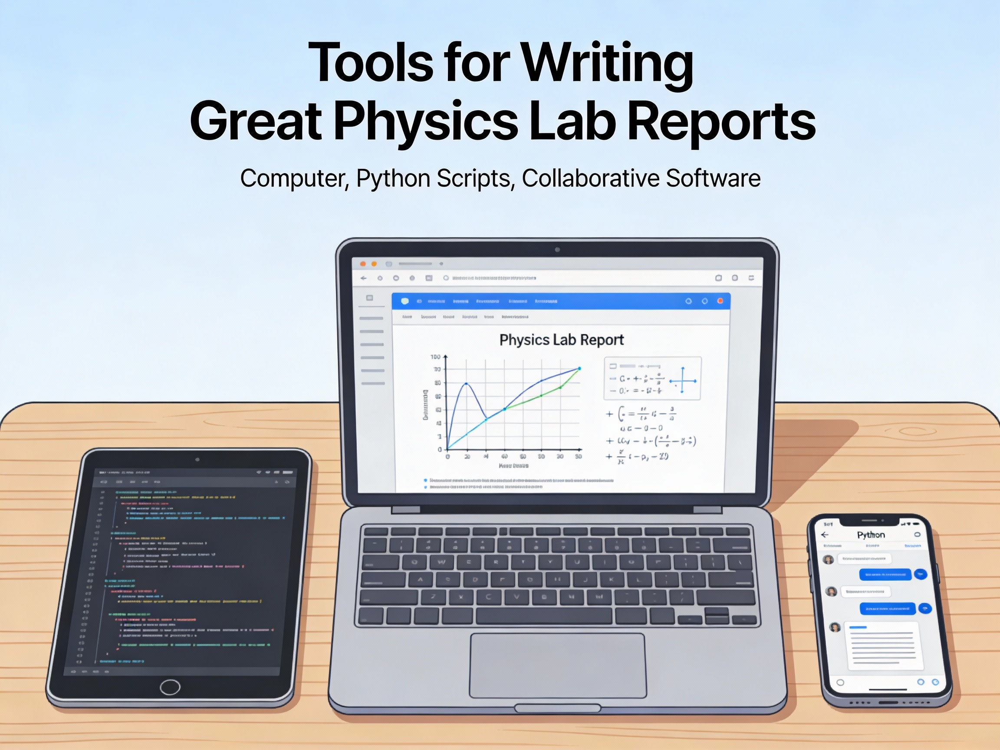

# Building Excellent Physics Lab Reports - *Using Jupyter Book, Colab, Python, Markdown, and LaTeX*

Physics lab reports are not just a record of what you did—they are a way to **communicate scientific thinking**. 
A strong lab report clearly explains the physical ideas, documents how data were collected and analyzed, and 
presents results in a form that others can **understand, reproduce, and evaluate**. In this set of notes, we focus on 
building lab reports that are **clear, professional, and reproducible**, using the same tools increasingly 
used in modern science and engineering.

We use **Jupyter Book**, **Google Colab**, **Python**, **Markdown**, and **LaTeX** to combine writing, 
computation, and visualization in a single workflow. These tools allow you to analyze data, generate figures, 
and explain results in one place—without switching between software or worrying about formatting 
inconsistencies. Just as importantly, they emphasize good scientific habits: transparency, organization, and clarity of reasoning.

This book is not about learning programming for its own sake. Instead, it treats code as a **tool for thinking**,
much like algebra or calculus. The goal is to help you produce lab reports that communicate physics effectively, 
reflect your understanding, and meet professional standards—skills that extend well beyond this course.

