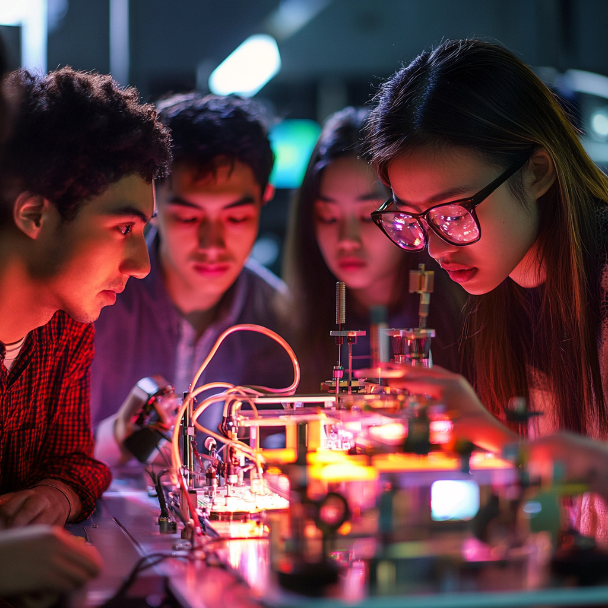

# Notes for University Physics I Lab

This lab course is designed to accompany University Physics I, providing hands-on experimental 
experience to reinforce the fundamental concepts of mechanics, oscillations, waves, and thermodynamics. 
tudents will engage in a series of structured experiments emphasizing data collection, error analysis, a
nd the development of scientific reasoning skills. The course begins with an introduction to measurement 
techniques and uncertainty, then progresses through experiments exploring kinematics, forces, energy, 
momentum, and rotational dynamics. Later labs investigate oscillatory motion, wave behavior, and 
basic thermal phenomena. A strong emphasis is placed on experimental design, proper use of 
laboratory equipment, and the interpretation of results using graphical and computational methods. 
Students are expected to maintain a detailed lab notebook, work collaboratively, and 
communicate findings effectively through clear written reports, fostering both technical 
proficiency and a deeper conceptual understanding of physical principles.

